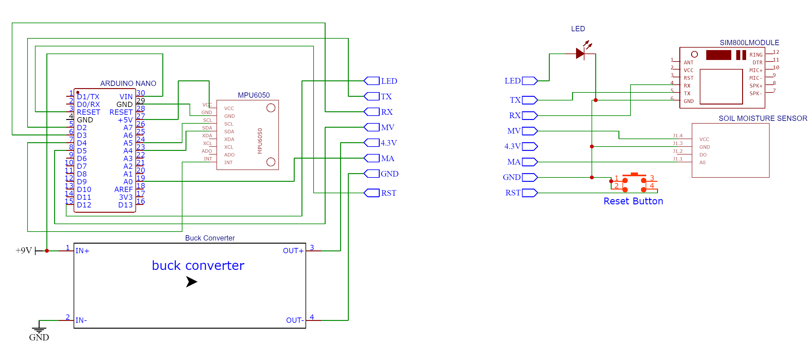

# Land Slide Detection using Wireless Sensor Network

## Description

This repository contains the resources needed for building a landslide detection system using a wireless sensor network. It includes the following components:

- Circuit diagram for setting up the sensor network.
- Arduino code for processing sensor data and triggering alerts.
- HTML file for graphically displaying the results.

## Demo

## Demo Video

 [YouTube Demo Video](https://www.youtube.com/watch?v=QGzigIH8xJo).

## Images

Circuit Diagram:

